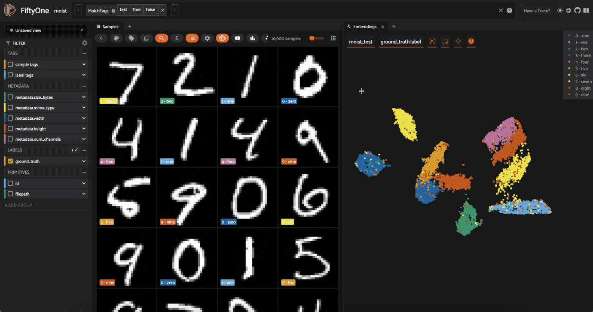

# Practical Computer Vision with PyTorch and FiftyOne

***Visualizing image embeddings in a 2D space through the FiftyOne app***

This repository provides tutorials for people at various stages of learning computer vision. It covers foundational concepts, such as image representation and the basics of neural networks, and extends to more advanced topics including generative models and zero-shot learning. The material is designed to be useful for those new to the field as well as practitioners looking to work with contemporary tools and techniques.

## 🛠️ Get Started: Setting Up Your Environment

Before starting the notebooks, prepare your environment using these setup guides:

*   [Installing Python 3.11](https://github.com/andandandand/practical-computer-vision/blob/main/docs/installing_python311.md)
*   [Installing FiftyOne with venv](https://github.com/andandandand/practical-computer-vision/blob/main/docs/fiftyone_venv.md) (for local development)
*   [Running inference notebooks inside a Dev Container](https://github.com/andandandand/practical-computer-vision/blob/main/docs/running_dev_container.md) (for a consistent Dockerized environment)
*   [Setting up GPU and TPU usage on Kaggle Notebooks](https://github.com/andandandand/practical-computer-vision/blob/main/docs/kaggle-gpu-tpu-guide.md)
*   [Setting up a wandb API token and using it on Kaggle Notebooks and Google Colab](https://github.com/andandandand/practical-computer-vision/blob/main/docs/setup-wandb.md) (for experiment tracking)
*   [Setting up kagglehub on Google Colab](https://github.com/andandandand/practical-computer-vision/blob/main/docs/kagglehub_setup_colab.md) (for accessing Kaggle models and datasets)
*   [Setting up a HuggingFace token](https://github.com/andandandand/practical-computer-vision/blob/main/docs/huggingface-account-and-token.md) (for accessing models and datasets from Hugging Face Hub)
*   [Copying data folders without download through Google Drive](https://github.com/andandandand/practical-computer-vision/blob/main/docs/add_shortcut_to_google_drive.md) (a method for large datasets)

## 📚 Tutorial Notebooks 

This collection of tutorial notebooks is organized to progress from foundational concepts to advanced applications. Click the badges to open them in Google Colab or Kaggle.

| Module / Topic                      | Notebook Title                                                                 | Description                                                                                                | Run Online                                                                                                                                                                                                                                                                                                                                                                                       |
| :---------------------------------- | :----------------------------------------------------------------------------- | :--------------------------------------------------------------------------------------------------------- | :----------------------------------------------------------------------------------------------------------------------------------------------------------------------------------------------------------------------------------------------------------------------------------------------------------------------------------------------------------------------------------------------- |
| **1. Foundations**                   | Digital Image Representation                                                   | Understand how images are represented in PIL, NumPy, and PyTorch.                                          |   |
|                                     | Matrix Multiplication, Activations, & Network Shape                            | Explore neural network mechanics: matrix math, non-linearities, and network architecture.     |   |
| **2. Introduction to FiftyOne**      | Getting Started with FiftyOne Datasets                                         | Learn to load, explore, and visualize image datasets using FiftyOne.                                 |  |
| **3. Basic Neural Networks**         | MLP for Image-based Regression                                                 | Train a Multilayer Perceptron (MLP) for regression tasks based on image features.                 |   |
|                                     | Predicting Car Prices From Images                                              | Apply MLP regression to predict car prices from their images.                                               |   |
| **4. Convolutional Neural Networks (CNNs)** | Fundamentals of CNNs with LeNet5                                           | Implement LeNet5 for digit recognition (Kaggle competition).                                    |   |
|                                     | Looking into LeNet5 with Random Weights                                      | Investigate LeNet5 behavior with random weight initialization.                 |   |
|                                     | Dropout Visualization on MNIST                                                 | Understand and visualize dropout regularization on MNIST images.                           |   |
| **5. Advanced Classification & Transfer Learning** | Classifying Pet Images by Breed                                            | Tackle image classification: identifying pet breeds.                                     |   |
|                                     | Pretrained ResNets for Classification                                          | Use pre-trained ResNet models (ImageNet) for image labeling.                           |   |
|                                     | Fine-tuning a ResNet for Multilabel Classification                             | Adapt a pre-trained ResNet for multilabel image tasks.                                |   |
|                                     | Interpretability with Class Activation Mapping (CAM)                           | See which image parts contribute to CNN classification.                |   |
| **6. Image Embeddings & Similarity** | Intuitions about Image Embeddings                                              | Understand image embeddings and pairwise comparisons.                   |   |
|                                     | Extracting Embeddings with Pretrained ResNet34                                 | Generate image embeddings using a pre-trained ResNet34.                                  |   |
|                                     | Visualizing Embeddings & Clustering with FiftyOne                              | Use FiftyOne to visualize and cluster image embeddings.                                |   |
|                                     | Visualizing Image Embeddings with TensorBoard                                  | Use TensorBoard for visualizing high-dimensional embedding spaces.             |   |
|                                     | Image Neighborhoods & Clustering with sklearn                                  | Find similar images and cluster street artwork using scikit-learn.       |   |
| **7. Image Segmentation**            | Semantic Segmentation with U-Net                                               | Perform pixel-level classification (semantic segmentation) using U-Net.        |   |
| **8. Zero-Shot Learning**           | Intro to CLIP & Zero-Shot Classification                                       | Discover CLIP for zero-shot image classification.              |   |
|                                     | Zero-Shot Object Detection with Grounding DINO                                 | Perform object detection for new classes using Grounding DINO.            |   |
| **9. Generative Models**            | Denoising Diffusion U-Net for MNIST Generation                                 | Explore DDPMs with a U-Net for generating MNIST digits.     |  |
|                                     | Artwork Generation with Stable Diffusion XL                                    | Generate images using the Stable Diffusion XL model.                       |  |
| **10. Utilities & Data Collection** | Scraping Public Domain Artwork from Bing Images                                | Scrape images from Bing and save to Google Drive for custom datasets. |  |

## 🎓 Full Course with Evaluations

For a structured learning experience with quizzes and assignments, enroll in the full course on openHPI:
*   [Practical Computer Vision with PyTorch on openHPI](https://open.hpi.de/courses/computervision2025)

## 🎬 Watch the Series on YouTube

Video tutorials are available:
*   [YouTube Playlist](https://www.youtube.com/playlist?list=PLf-F6yXx9sp9YgRLzuegQWxA71XD13tVH)
*   [Review Questions for each video](https://github.com/andandandand/practical-computer-vision/blob/main/docs/review_questions.md) to check understanding.

## 💬 Join the Community

For questions, tutorial discussions, or project sharing, join the FiftyOne Community Discord. The channel for this content is **#practical-computer-vision-workshops**.
*   [FiftyOne Community Discord - Invite Link](https://link.voxel51.com/ES8AlNG)
*   [Direct Channel Link](https://discord.com/channels/1266527359511564372/1345119286041116763) (You must accept the invite via the link above first!)

## Contributing, Contact & License

You are welcome to fork this repository, experiment with the code, and contribute. Please maintain the Creative Commons Attribution License.

#### Author: Antonio Rueda-Toicen

**antonio.rueda.toicen 'at' hpi 'dot' de**

This work is licensed under a [Creative Commons Attribution 4.0 International License](http://creativecommons.org/licenses/by/4.0/).

Happy learning!
